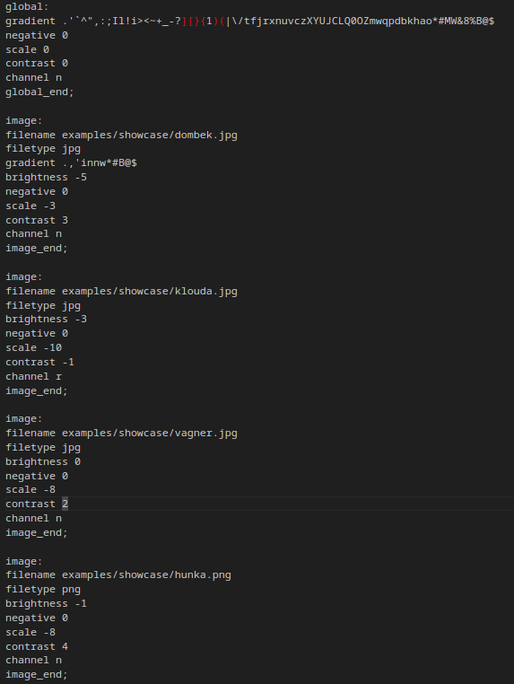
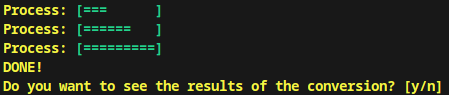
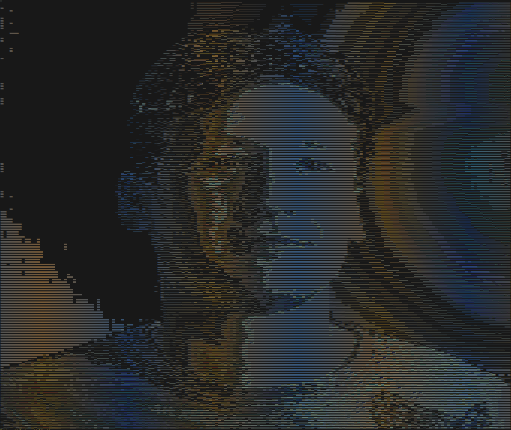

## Disclamer
This repository contains the code for the semester project of the subject [Programming and Algorithms 2](https://courses.fit.cvut.cz/BI-PA2/) studied during the second semester at the Czech Technical University in Prague.

The objective of the semester work was to make a fully working project on a given theme, which each student received personally. There were also some rules, such as required functionality, restrictions on the amount of memory our programs could use or a limited number of libraries we were allowed to use while writing the program.

# ASCII-art
The goal of mine semester project was to create an ASCII-art generator, which also allows user apply filters on the art
## Requirements for the functionality:
ASCII-art generator should:
- [X] be able to process images of JPEG and PNG formats;
- [X] implement at least 5 filters (exmp: brigtness, negative ... );
- [X] save results of the conversion into files and present them to the user
- [X] give user an ability to manipulate the presentation
- [X] be configured from the file

## Description
Converter will process a config.txt file, added as a parameter to the application, where all information for conversion
will be provided. This file should be filled by a user according to the template^. As a result converter will receive a
file with default filters for ASCII conversion, image files and filters for the conversion of each file. After that application
will convert each image according to filter. Results will be saved in .txt files in the same folder as source images.
Then the user will be able to run presentation^^ of the results in the terminal, or exit the application.

^:  File should be filled accurately according to the template or the error message will be sent!
    1. There are two types of blocks that can be in this file:
        -> global   ( global filters, set as default, if there won't be specified explicit filters for the image, those will be used)
        -> image    ( filters for each image )
    2. Each block has filters + setting which can be specified in it ( format := filter_name ( values to be passed ) info example)
        -> global   -> gradient     ( a string of chars you want to use as gradient ) String should have chars from the darkest one the brightest   .*OM#
                    -> brightness   ( [-5;5] )                                        Where -5 is the darkest, 5 is the brightest                   5
                    -> negative     ( {0;1} )                                         Where 0 is natural, 1 is negative                             1
                    -> contrast     ( [-5;5] )                                        Where -5 is the least contrast, 5 is the most contrast        5
                    -> scale        ( [-10;10] )                                      Where -10 is the smallest, 10 is the biggest                  5
                    -> channel      ( {n,r,g,b} )                                     Where "n" is "NO CHANGE", "r" - RED,"g" - GREEN, "b" - BLUE   n
        -> image    *! The first two settings should always be the same
                    -> filename     ( a string of chars which is the name of the file with dot and filetype ) Doublecheck the name of your file     photo.png
                    -> filetype     ( a string which is the filetype of the file you've written above ) Pass only the type, without the dot         png
                    * other filters are totally the same as filters of the 'global block'
    3. Notes:       1. Don't make mess in the file, or you will receive an error ;) ('\n' at the end is ESSENTIAL)
                    2. If you want you can separate blocks by '\n'
                    3. In the examples/ folder you already have config.txt template, so you can just adjust already prepared config how you want
                    
^^: Application will communicate with the user using CLI. The user can agree on running a presentation or disagree.
When presentation started, user can move to the next picture (by pressing "n"), to the previous one (by pressing "p") or
quit the presentation (by pressing "q").

## Work examples:
### Sample configfile:

### Image processing

### Result (generated ASCII-art)

## Comile and run:
- You should have libjpeg installed (`sudo apt install libjpeg-dev`);
- You should have libpng installed (`sudo apt install libpng-dev`);
- To generate the documentation, you need to have doxygen installed (`sudo apt-get install doxygen`);
- `make all` - Compile the application and generate documentation;
- `make run` - Launch the application with the showcase;
- `./asciiart path_to_the_configfile` - Convert to ASCII-art your own images
- `make clean` - Removing all compiled files;